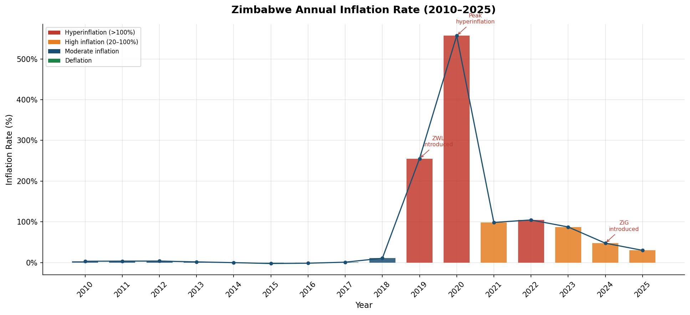
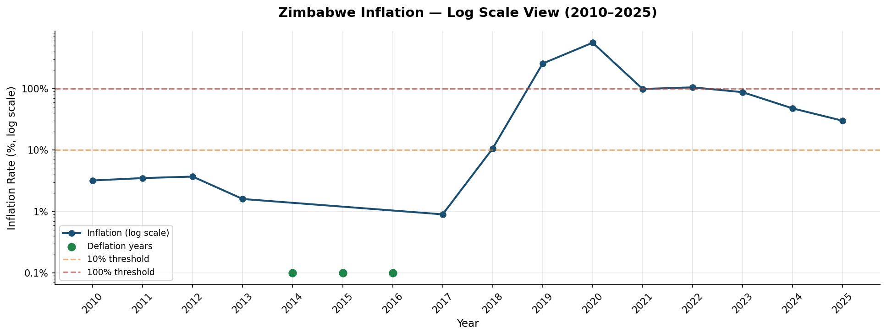
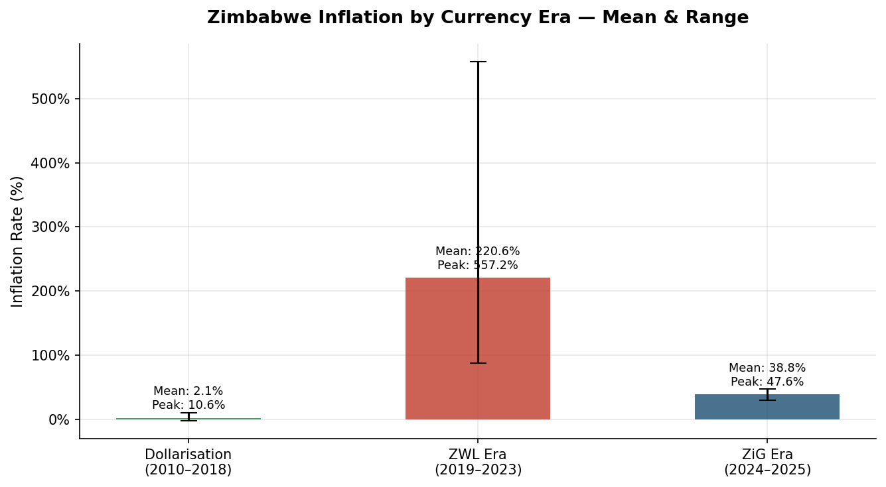
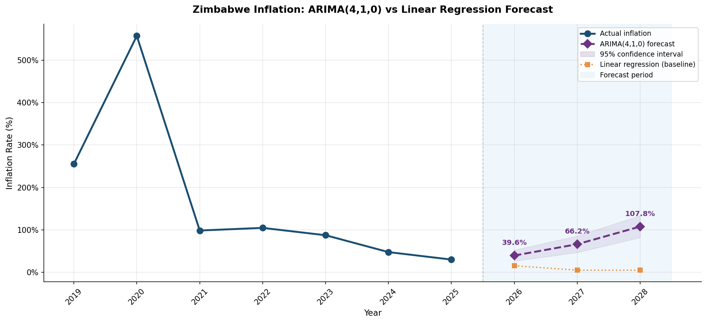
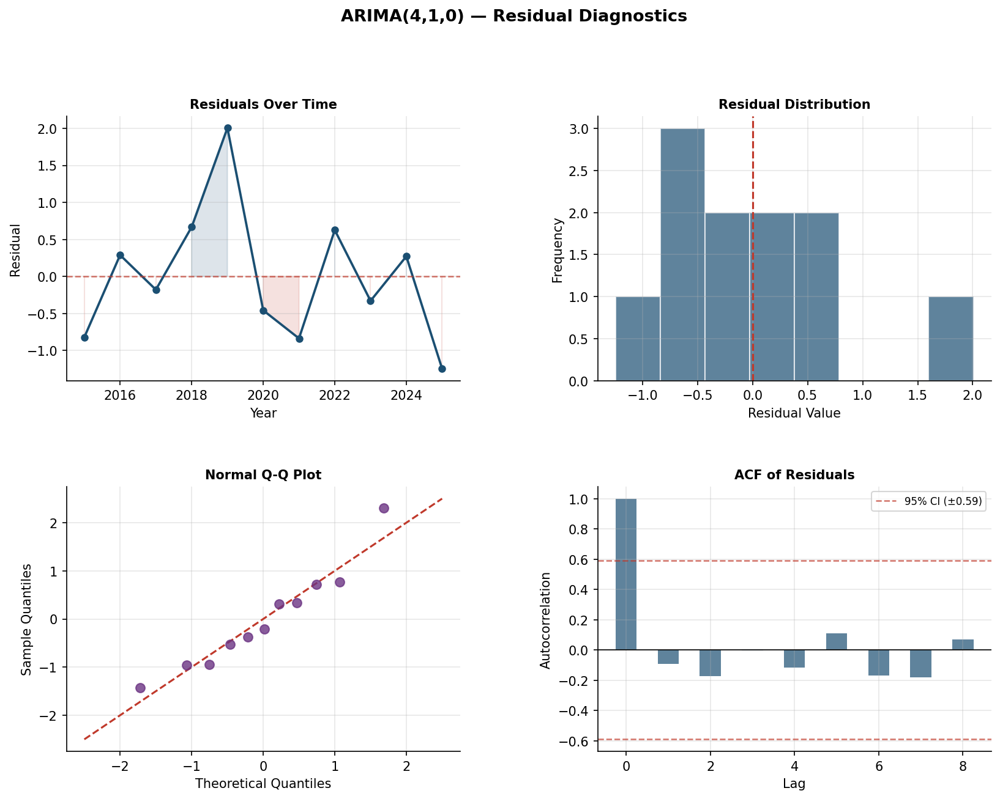
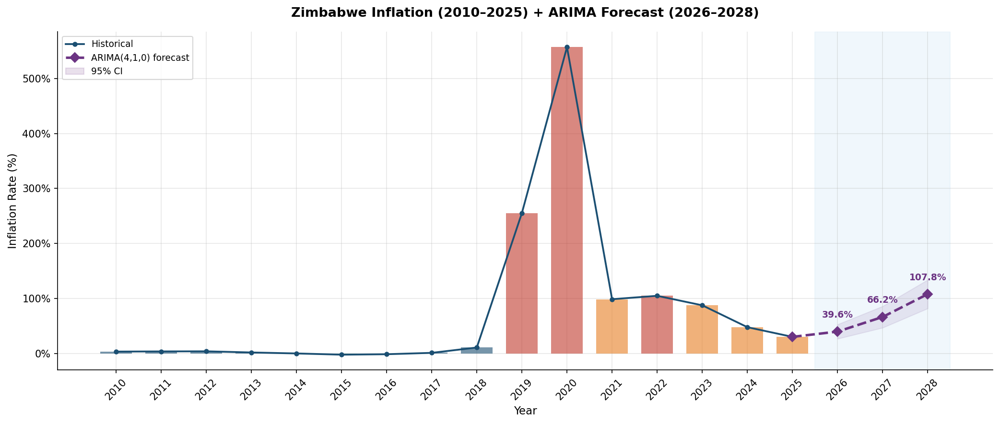

# 🇿🇼 Zimbabwe Inflation Analysis & ARIMA Forecasting (2010–2025)

> **Author:** Shareef Chitesi  
> **Degree:** BSc Honours in Applied Mathematics and Computational Science  
> **Institution:** Midlands State University — Year 2  
> **Tools:** Python · Pandas · NumPy · Matplotlib · Seaborn · Power BI · Excel  

---

## The Story Behind This Project

Zimbabwe has one of the most extraordinary inflation histories in the world. I grew up watching prices change overnight, seeing currencies come and go, and hearing adults talk about the economy in ways that never quite made sense to me as a child. When I started studying Applied Mathematics and Statistics at university, I finally had the tools to go back and actually *understand* what happened — and more importantly, to model where things might be heading.

This project is my attempt to do exactly that. Using real data from the World Bank, RBZ, and ZIMSTAT, I analysed 15 years of Zimbabwe's inflation history across three very different currency eras. I then built a full **ARIMA model from scratch** — without using any forecasting libraries — implementing the mathematics directly using NumPy's linear algebra tools. This means every AR coefficient, every AIC calculation, and every residual diagnostic was hand-coded using the same mathematical principles covered in my degree.

This isn't just an academic exercise. For banks, insurers, and financial institutions operating in Zimbabwe, understanding inflation behaviour is critical — for pricing products, managing risk, and planning for the future. This project is my way of showing that I can think about those problems quantitatively and rigorously.

---

## 📊 What I Found

| Metric | Value |
|--------|-------|
| Period covered | 2010 – 2025 |
| Peak inflation | **557.2%** (2020 — ZWL hyperinflation) |
| Lowest point | **-2.4%** (2015 — deflation) |
| Mean inflation (full period) | **75.0%** |
| Median inflation | **7.2%** |
| Selected model | **ARIMA(4, 1, 0)** — chosen by AIC |
| AIC | **38.100** |
| Forecast 2026 | **39.6%** (95% CI: 26.6% – 52.6%) |
| Forecast 2027 | **66.2%** (95% CI: 46.7% – 85.7%) |
| Forecast 2028 | **107.8%** (95% CI: 81.8% – 133.9%) |

The ARIMA model is more cautious than a simple linear trend — it picks up Zimbabwe's historical pattern of volatile oscillation and projects it forward. That pessimism is mathematically honest: with only 16 annual data points and a history of policy shocks, high uncertainty is the right answer.

---

## 💱 Three Very Different Eras

| Era | Period | Mean Inflation | What Happened |
|-----|--------|---------------|---------------|
| **Dollarisation** | 2010–2018 | ~2.5% | Stability after the 2008 hyperinflation. Zimbabwe adopted the USD and inflation stayed low — even dipping into deflation between 2014 and 2016. |
| **ZWL Era** | 2019–2023 | ~220.6% | The reintroduction of a local currency triggered a rapid loss of confidence. Inflation peaked at 557% in 2020 before gradually declining. |
| **ZiG Era** | 2024–2025 | ~38.8% | The Zimbabwe Gold was introduced in April 2024, backed by gold reserves. Early signs suggest stabilisation, with ZIMSTAT reporting a monthly rate of just 1.06% in April 2026. |

---

## 📐 ARIMA Implementation — Built From Scratch

Rather than calling `statsmodels.tsa.arima`, I implemented the model mathematically from first principles. Here is what each step involved:

### Step 1 — Stationarity (the "I" in ARIMA)
Applied log transformation followed by first differencing (d=1) to remove the non-stationary trend. This is conceptually identical to finding the equilibrium solution in a differential equation — a technique from my ODEs coursework.

```
Original std: 140.82%  →  Log-differenced std: 0.95  ✓ Stationary
```

### Step 2 — Parameter Estimation (Linear Algebra)
Used OLS via the **normal equations** to estimate AR coefficients:

```
β = (XᵀX)⁻¹ Xᵀy
```

This is the same matrix operation from Linear Algebra I (HMAT133) — applied directly to a real forecasting problem.

### Step 3 — Model Selection (AIC)
Tested AR orders p = 1 to 4. Selected the model with the lowest AIC:

```
AIC = 2k − 2·ln(L)

ARIMA(1,1,0)  AIC = 41.757
ARIMA(2,1,0)  AIC = 40.695
ARIMA(3,1,0)  AIC = 40.547
ARIMA(4,1,0)  AIC = 38.100  ← selected
```

### Step 4 — Residual Diagnostics
Validated model fit using four diagnostic checks:
- Residuals over time (should be random, centred at zero)
- Residual distribution (should be approximately normal)
- Normal Q-Q plot (should follow the 45° line)
- ACF of residuals (should show no significant autocorrelation)

---

## 📈 Visualisations

### 1. Historical Inflation (2010–2025)


### 2. Log-Scale View


### 3. Era Comparison


### 4. ARIMA vs Linear Regression Forecast


### 5. Residual Diagnostics (4-panel)


### 6. Full History + ARIMA Forecast


---

## 🗂️ Repository Structure

```
zim-inflation-analysis/
│
├── analysis.py                        # Descriptive analysis & linear regression
├── arima_analysis.py                  # ARIMA from scratch — main forecasting script
│
├── data/
│   └── zimbabwe_inflation_data.xlsx   # 4 sheets: Historical, ARIMA Forecast,
│                                      # Model Summary, Residuals
│                                      # (Import directly into Power BI)
│
├── outputs/
│   ├── 01_historical_inflation.png
│   ├── 02_log_scale_inflation.png
│   ├── 03_forecast.png                # Original linear forecast
│   ├── 04_era_comparison.png
│   ├── 05_arima_forecast.png          # ARIMA vs linear comparison
│   ├── 06_residual_diagnostics.png    # 4-panel model validation
│   └── 07_full_history_arima.png      # Full 2010–2028 view
│
└── README.md
```

---

## ⚙️ How to Run

### Requirements
```bash
pip install pandas numpy matplotlib seaborn openpyxl
```

No statsmodels needed — ARIMA is implemented from scratch.

### Run descriptive analysis
```bash
python analysis.py
```

### Run ARIMA forecasting
```bash
python arima_analysis.py
```

---

## Honest Limitations

I want to be transparent about what this model can and can't do:

- With only 16 annual data points, any model has limited statistical power
- Zimbabwe's inflation is heavily policy-driven — a single monetary decision can invalidate any projection
- The ARIMA(4,1,0) forecast's upward trajectory reflects historical volatility, not necessarily future reality
- Monthly ZIMSTAT data would produce a significantly more robust model

That said, the wide confidence intervals are intentional — they honestly represent genuine uncertainty rather than false precision.

---

## 🔮 What's Next

- [ ] Upgrade to monthly ZIMSTAT CPI data for a more granular model
- [ ] Add USD/ZiG exchange rate as an exogenous variable (ARIMAX)
- [ ] Build a full interactive Power BI dashboard
- [ ] Regional comparison — Zimbabwe vs Zambia vs South Africa
- [ ] CPI component breakdown — food, transport, housing

---

## 💬 Why This Matters

For anyone working in Zimbabwean financial services — banks, insurance companies, pension funds, regulators — inflation is not an abstract concept. It affects premium pricing, loan default risk, reserve calculations, and investment decisions every single day.

As someone studying Applied Mathematics and hoping to work in this sector, I built this project to show that I understand that connection — and that I have the mathematical skills to model it rigorously, not just describe it.

---

## 📬 Get in Touch

**Shareef Chitesi**  
📧 chitesishareef46@gmail.com  
📞 +263782729397  
🎓 BSc Applied Mathematics & Computational Science — Midlands State University
