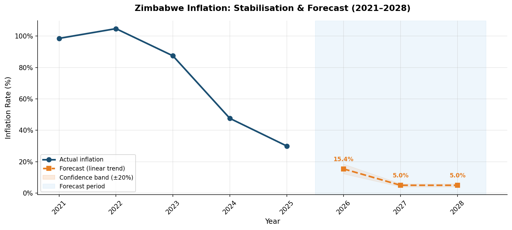

# 🇿🇼 Zimbabwe Inflation Analysis & Forecasting (2010–2025)

> **Author:** Shareef Chitesi  
> **Degree:** BSc Honours in Applied Mathematics and Computational Science  
> **Institution:** Midlands State University — Year 2  
> **Tools:** Python · Pandas · NumPy · Matplotlib · Seaborn · Power BI · Excel  

---

## The Story Behind This Project

Zimbabwe has one of the most extraordinary inflation histories in the world. I grew up watching prices change overnight, seeing currencies come and go, and hearing adults talk about the economy in ways that never quite made sense to me as a child. When I started studying Applied Mathematics and Statistics at university, I finally had the tools to go back and actually *understand* what happened — and more importantly, to model where things might be heading.

This project is my attempt to do exactly that. Using real data from the World Bank, RBZ, and ZIMSTAT, I analysed 15 years of Zimbabwe's inflation history across three very different currency eras — the relative calm of dollarisation, the chaos of the Zimbabwe Dollar, and the cautious optimism of the new Zimbabwe Gold (ZiG). I then built a forecasting model to project inflation through to 2028.

This isn't just an academic exercise. For banks, insurers, and financial institutions operating in Zimbabwe, understanding inflation behaviour is critical — for pricing products, managing risk, and planning for the future. This project is my way of showing that I can think about those problems quantitatively.

---

## 📊 What I Found

The numbers tell a dramatic story:

| Metric | Value |
|--------|-------|
| Period covered | 2010 – 2025 |
| Peak inflation | **557.2%** (2020 — ZWL hyperinflation) |
| Lowest point | **-2.4%** (2015 — deflation during dollarisation) |
| Mean inflation (full period) | **75.0%** |
| Median inflation | **7.2%** |
| Forecast 2026 | **~15.4%** |
| Forecast 2027 | **~5.0%** |
| Forecast 2028 | **~5.0%** |

The median of 7.2% versus a mean of 75% tells you everything — a small number of extreme years (2019–2022) completely distort the average. This is why log-scale visualisation matters when working with Zimbabwe's data, and why I built both a standard and a log-scale chart.

---

## 💱 Three Very Different Eras

| Era | Period | Mean Inflation | What Happened |
|-----|--------|---------------|---------------|
| **Dollarisation** | 2010–2018 | ~2.5% | Stability after the 2008 hyperinflation. Zimbabwe adopted the USD and inflation stayed low — even dipping into deflation between 2014 and 2016. |
| **ZWL Era** | 2019–2023 | ~220.6% | The reintroduction of a local currency triggered a rapid loss of confidence. Inflation peaked at 557% in 2020 before gradually declining. |
| **ZiG Era** | 2024–2025 | ~38.8% | The Zimbabwe Gold was introduced in April 2024, backed by gold reserves. Early signs suggest stabilisation, with ZIMSTAT reporting a monthly rate of just 1.06% in April 2026. |

---

## 📈 Visualisations

### 1. Historical Inflation (2010–2025)
Colour coded by severity — green for deflation, blue for moderate, orange for high, red for hyperinflation.


### 2. Log-Scale View
The standard chart makes the pre-2019 years invisible. The log scale reveals what was actually happening during the dollarisation era.


### 3. Stabilisation & Forecast (2021–2028)
A linear trend fitted on the 2021–2025 stabilisation period projects inflation falling to around 15% in 2026 and approaching 5% by 2027–2028 — assuming ZiG monetary policy holds.


### 4. Era Comparison
Side by side comparison of mean inflation and the full range (min to max) across the three currency eras.


---

## 🗂️ Repository Structure

```
zim-inflation-analysis/
│
├── analysis.py                        # Main Python analysis script
│
├── data/
│   └── zimbabwe_inflation_data.xlsx   # Cleaned data — 3 sheets:
│                                      # Historical Data, Forecast, Summary
│                                      # (Import directly into Power BI)
│
├── outputs/
│   ├── 01_historical_inflation.png
│   ├── 02_log_scale_inflation.png
│   ├── 03_forecast.png
│   └── 04_era_comparison.png
│
└── README.md
```

---

## ⚙️ How to Run It Yourself

### Install dependencies
```bash
pip install pandas numpy matplotlib seaborn openpyxl
```

### Run the analysis
```bash
python analysis.py
```

Charts save to `outputs/` and the Excel file to `data/`. The Excel file is ready to import directly into Power BI.

---

## 📐 Methodology

### Data Sources
- **World Bank** — Annual CPI inflation (%)
- **Reserve Bank of Zimbabwe (RBZ)** — Monetary policy context and exchange rate data
- **ZIMSTAT** — Consumer Price Index releases and monthly inflation figures

### Approach
1. **Descriptive statistics** — mean, median, range analysed separately per currency era to avoid cross-era distortion
2. **Log transformation** — applied for visualisation to make all eras readable on a single chart
3. **Linear regression forecasting** — fitted on 2021–2025 only, since including hyperinflation years would make the forecast meaningless
4. **Confidence bands** — set at ±20% of the forecast to reflect genuine uncertainty around ZiG policy outcomes

### Honest Limitations
I want to be transparent about what this model can and can't do. A linear trend on 5 years of data is a starting point, not a definitive forecast. Zimbabwe's inflation is heavily policy-driven — a single monetary policy decision can invalidate any statistical projection. A more robust model would use:
- Monthly ZIMSTAT CPI data (more granular)
- ARIMA or Prophet for time series modelling
- Exchange rate and money supply as explanatory variables

That is the next phase of this project.

---

## 🔮 What's Next

- [ ] Upgrade to ARIMA/SARIMA using monthly CPI data from ZIMSTAT
- [ ] Add USD/ZiG exchange rate correlation analysis
- [ ] Build a full interactive Power BI dashboard
- [ ] Regional comparison — Zimbabwe vs Zambia vs South Africa
- [ ] Break down CPI by component — food, transport, housing

---

## 💬 Why This Matters

For anyone working in Zimbabwean financial services — banks, insurance companies, pension funds, regulators — inflation is not an abstract concept. It affects premium pricing, loan default risk, reserve calculations, and investment decisions every single day. 

As someone studying Applied Mathematics and hoping to work in this sector, I built this project to show that I understand that connection — and that I have the skills to model it quantitatively.

---

## 📬 Get in Touch

**Shareef Chitesi**  
📧 chitesishareef46@gmail.com  
📞 +263782729397  
🎓 BSc Applied Mathematics & Computational Science — Midlands State University
